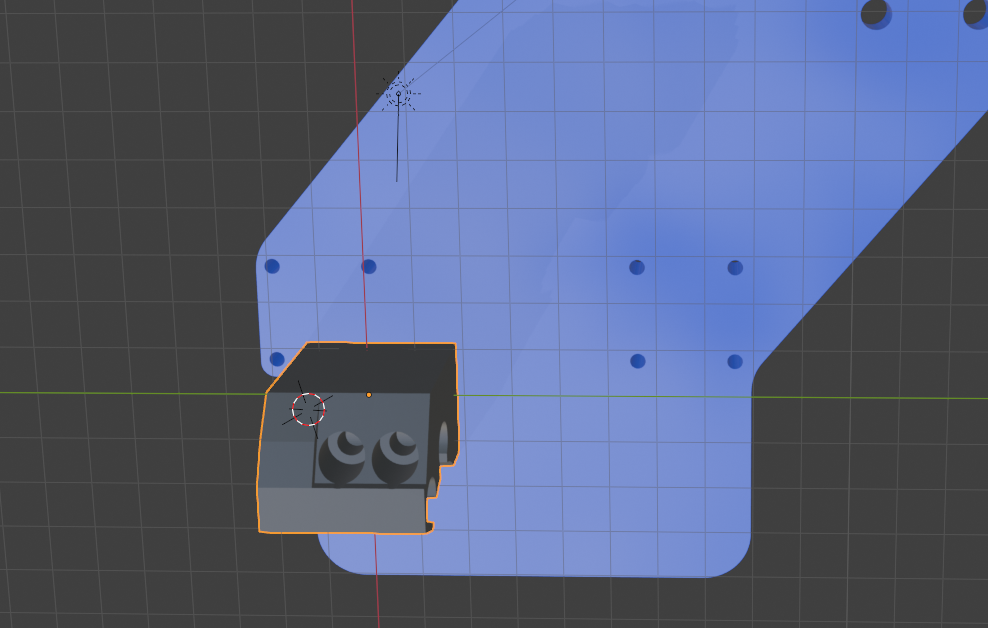
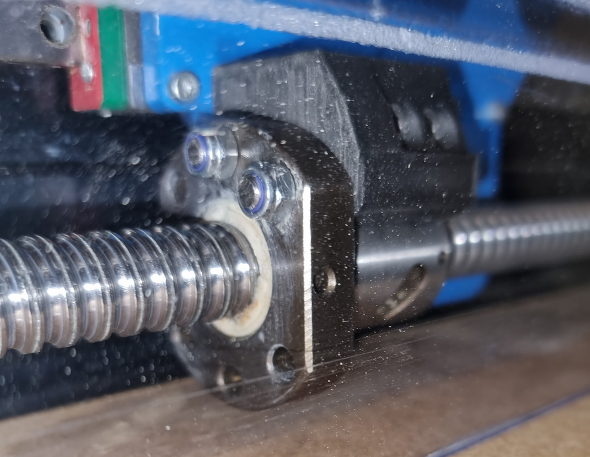

# Stronger y-coupling.

A stronger 3d-printed coupling between the y-ballscrews nuts and the gantry. 

[STL-file](./y-coupling.stl)

[Blender file](y-coupling.blend)

PS. Notice the circular pocket on the side that faces the gantry. 
This is for the head of one of the screws that attaches the gantry to the rail-block.

Bolts required:
* 2 x 35mm M4 hex bolts for attachment to the gantry
* 2 x 25mm M4 hex bolts for attachment to the ballscrews nuts

The 25mm bolts needs to be mounted first as the holes intersect.
Secure the 25mm bolts with M4 nyloc nuts on the other side of the ballscrew nut.
Then attach to the gantry. 

