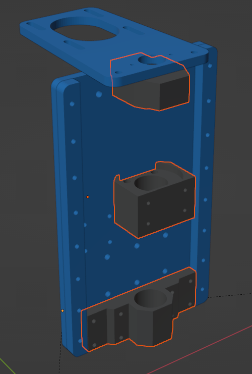
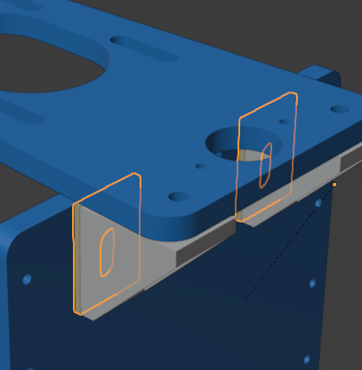
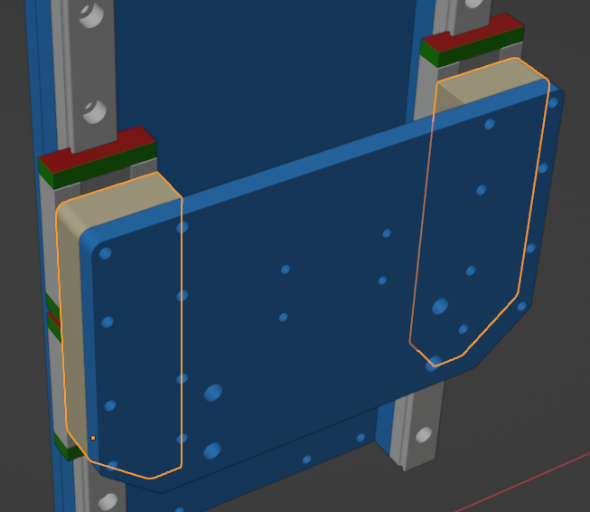
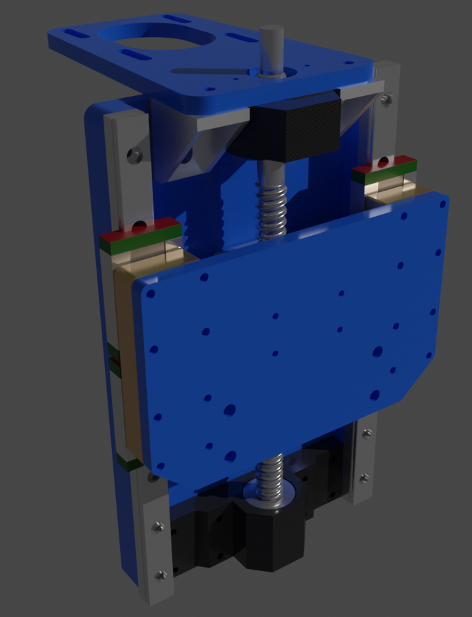

# Upgrading my z-axis to SFU-1204 ballscrew.

I wasn't completely happy with the leadscrew on my Indymill. 
Seemed like a bit too much backlash, so I replaced it with a ballscrew.

Probably lots of ways of doing this upgrade. 
This was my approach:

https://flic.kr/p/2pzWSNw

## 3d-printed parts
* [topblock.stl](./3dprint/topblock.stl)
* [nutblock.stl](./3dprint/nutblock.stl)
* [bottomblock.stl](./3dprint/bottomblock.stl)

## Distance plates:
### Angle bracket shims
The z axis screw need to be moved forward a bit, so the aluminum angle brackets needs (at least) 2mm shims:
**_NOTE:_** These brackets come in different variants, so you might need more than 2 mm

*2mm plates behind aluminum angles*

### Spindle mount distance plates
The mount-plate for the spindle needs to be moved 12mm forward to allow space for the ballscrew nut.

*12mm plates between rail-blocks and spindle mount plate*

## Other parts needed
* M3 button head screws 22mm
* M3 button head screws 10mm (need to replace some original screws because of head size)
* Ball bearing 10mm x 22mm x 6mm (EZO 6900 2RS)
* Ball bearing  8mm x 22mm x 7mm
* Washer 8mm x 22mm x 2mm (x2)
* Nut (fine pitch thread) M10 x 1 x 3 (x2)

+ probably a few other things I've forgotten about  :-)

## Blend file (zaxis-with-sfu1204-ballscrew.blend)

*Included .blend file viewed in Blender*
